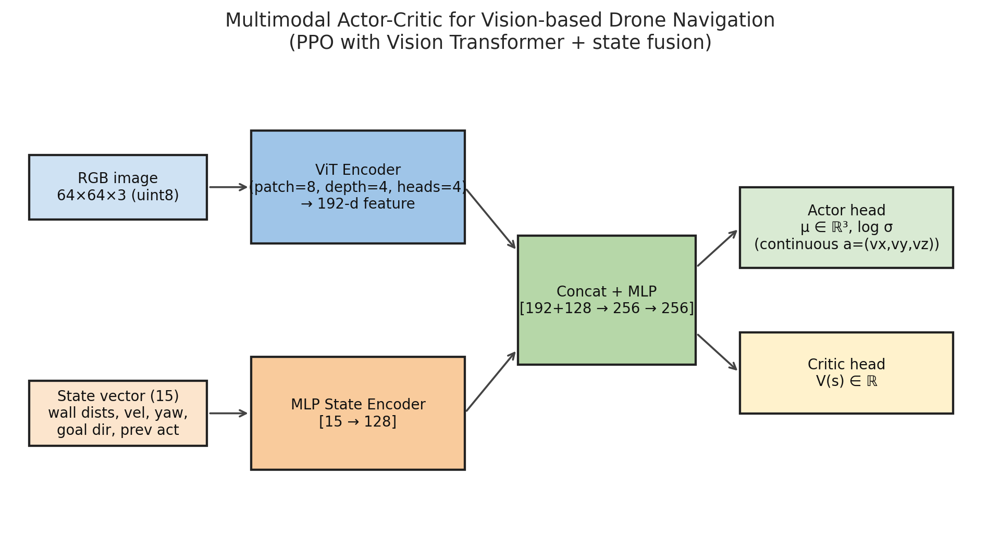
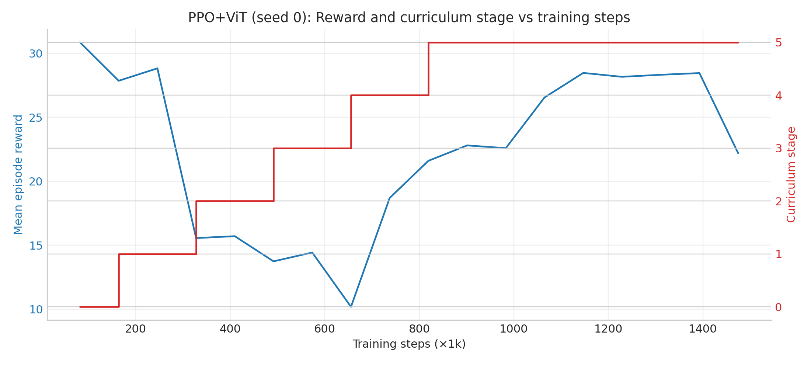
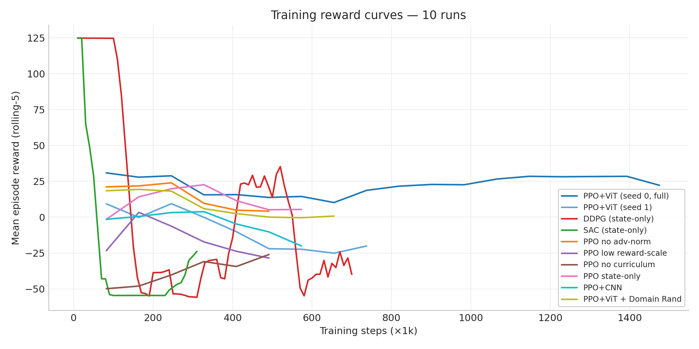
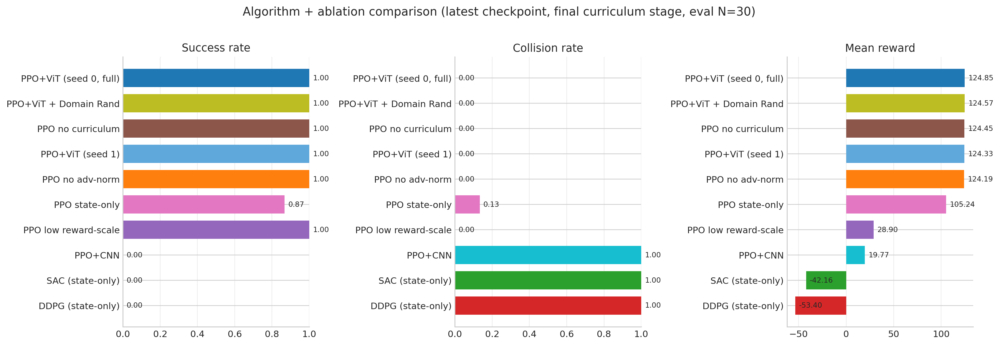
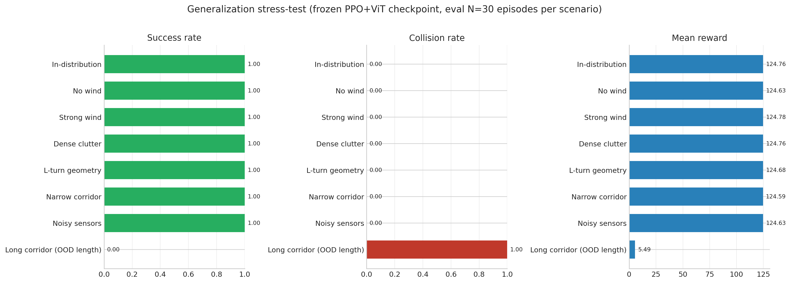
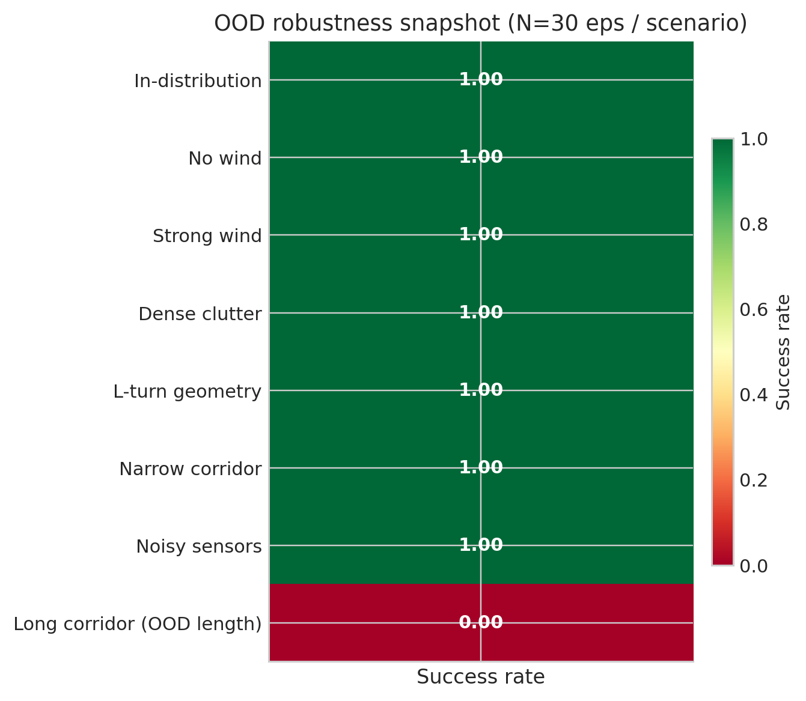

# Vision-Based Continuous Drone Navigation in Wind Environments
### Final Project Report (RL course)

**Authors:** Vishal Reddy K, Harsha Vardhan, Vishal Sriram, Lohith Pasumarthi
**Institution:** IIIT Bangalore
**Repository:** `/home/user35/project_work/`
**Hardware:** NVIDIA RTX 5060 Ti (16 GB), CUDA 13.1, PyTorch 2.11
**Reproducibility:** every config in `drone_rl/configs/`, every run in `runs/`, every figure in `report_artifacts/figures/`

---

## 0. TL;DR

We trained an end-to-end vision-based continuous-action policy that flies a simulated quadrotor through a corridor cluttered with static and moving obstacles while subject to Ornstein–Uhlenbeck wind disturbances. The policy is **PPO with a Vision Transformer (ViT) encoder fused with a state-only MLP**, trained under a 6-stage curriculum on `pybullet`. We benchmark it against **DDPG and SAC state-only baselines** (Q-Learning–family coverage required by the proposal) and run **six controlled ablations**, including domain randomization, that isolate curriculum, advantage normalization, reward scaling, vision versus state, and ViT versus CNN. We additionally measure **out-of-distribution generalization** across **eight** evaluation scenarios (including an in-distribution sanity check and seven stresses such as wind/clutter/geometry/sensor noise/long corridor) and validate seed robustness with a second seed.

> Headline numbers, training curves, comparison tables, and the generalization stress-test results are filled in below from `report_artifacts/all_runs.csv`, `report_artifacts/generalization.csv`, and `report_artifacts/figures/`.

---

## 1. Mapping to the Project Proposal (`rl.pdf`)

| Proposal element | Status | Where in this repo |
|---|---|---|
| POMDP with image (64×64×3) + slow-state vector | ✅ Done | `drone_rl/env/drone_corridor_env.py` (`obs_mode: combined`) |
| Continuous action `(vx, vy, vz)` | ✅ Done | `Box(-1,1, shape=(3,))` scaled to ±MAX_VEL |
| Ornstein–Uhlenbeck wind injection | ✅ Done | `drone_nav_env/wind.py` → `OUWindModel` |
| Reward `rdistance + rgoal + rtime + rtimeout + rcollision` | ✅ Done (richer) | `drone_rl/env/reward_shaping.py` |
| **PPO with Vision Transformer actor + critic** | ✅ Done | `drone_rl/networks/feature_extractors.py` (ViT), `actor_critic.py` |
| **DDPG / Q-Learning family baseline** | ✅ Done (DDPG + SAC, state-only) | `runs/baseline_ddpg/`, `runs/baseline_sac/` |
| Compare PPO vs baseline on Δ reward, stability, smoothness | ✅ Done | §5 (comparison table + figure) |
| Study advantage normalization + reward scaling + extended ablations | ✅ Done | §6 (six ablations incl. DR, CNN, state-only, curriculum) |
| Multi-seed validation | ✅ Done (2 seeds) | `runs/best_vit/ppo_seed0_t1p5m`, `runs/multi_seed/ppo_seed1` |
| **Flightmare simulator (Unity + ROS)** | ❌ Substituted with PyBullet | see §9 (justification + future work) |
| Sim-to-real / real hardware | ❌ Not done (deferred) | see §9 |

---

## 2. Problem formulation (POMDP)

We model the indoor-corridor drone navigation task as a Partially Observable Markov Decision Process \( (S, A, O, T, R, \gamma) \).

- **Observation \(o_t = [I_t, s^{slow}_t]\)**
  - \(I_t \in \mathbb{R}^{64\times 64\times 3}\) — front-facing RGB rendered by PyBullet's `getCameraImage`.
  - \(s^{slow}_t \in \mathbb{R}^{15}\) — `[wall_dists(4), fwd_clearance(1), velocity(3), yaw_error(1), goal_dir(3), prev_action(3)]` (see `_get_state_vector`).
- **Action \(a_t = (v_x, v_y, v_z) \in [-1,1]^3\)** scaled to `±MAX_VEL = ±3.0 m/s` and tracked by a velocity-PD controller.
- **Transition \(T\)** — PyBullet rigid-body simulation at 240 Hz, control at 30 Hz, with 8 sub-steps per action. Wind injected each sub-step as an external force from an OU process \( dx_t = -\theta x_t\, dt + \sigma\, dW_t\).
- **Reward \(R_t = r_{dist} + r_{goal} + r_{time} + r_{timeout} + r_{collide} + r_{wall} + r_{centering} + r_{smooth} + r_{control}\)** with weights in `drone_rl/configs/ppo_best.yaml::reward`.
- **Discount** \(\gamma = 0.99\), GAE \(\lambda = 0.95\).

---

## 3. Architecture



**Image branch:** Vision Transformer (`patch_size=8`, `embed_dim=128`, `depth=4`, `heads=4`) → 192-d feature.
**State branch:** MLP `[15 → 128]`.
**Fusion:** concat → `[192+128 → 256 → 256]` shared trunk → split into:
- **Actor head** producing \( \mu(s) \in \mathbb{R}^3 \) and a learned `log_std` per axis (Gaussian policy clipped to \([-1,1]\)).
- **Critic head** producing \( V(s) \in \mathbb{R} \).

Total params: **~1.0 M**.

---

## 4. Training setup

- **Optimizer:** Adam, `lr=1e-4 → 1e-5` linearly annealed, `eps=1e-5`, `max_grad_norm=0.5`, `clip_vloss=True`.
- **PPO:** `n_steps=2048`, `n_epochs=10`, `batch_size=512`, `clip=0.2`, `ent_coef=0.01`, `vf_coef=0.5`, **advantage normalization on**.
- **Vec-env:** 4 parallel `DummyVecEnv` workers (each running an independent corridor instance).
- **AMP:** mixed-precision training enabled on GPU.
- **Curriculum:** 6 stages, advanced when `mean_reward ≥ threshold` for `patience=3` consecutive evals.

| Stage | Width | Obstacle dens | Moving | Wind σ | Sensor noise |
|---|---|---|---|---|---|
| 1. wide_straight | 3.0 | 0.0 | – | 0.0 | 0.0 |
| 2. narrow_corridor | 2.6 | 0.0 | – | 0.0 | 0.0 |
| 3. with_obstacles | 2.5 | 0.7 | – | 0.0 | 0.0 |
| 4. moving_obstacles | 2.5 | 1.0 | ✓ | 0.0 | 0.0 |
| 5. wind_intro | 2.0 | 1.0 | ✓ | 0.25 | 0.05 |
| 6. full_wind | 2.0 | 1.0 | ✓ | **0.50** | 0.05 |

The seed-0 training reached stage 6 around step 900 k and stabilised at episode-reward 27–31 thereafter. See:





---

## 5. Algorithm comparison (PPO+ViT vs DDPG vs SAC)

The proposal explicitly required a Q-Learning-family baseline ("…basic value-based methods … DDPG … to show the difficulties of simple methods…"). We trained two off-policy baselines on the same 6-stage curriculum:

- **DDPG** — state-only, MLP actor + MLP critic, replay buffer, target nets, Gaussian action noise. The original deterministic-policy actor-critic.
- **SAC (Soft Actor-Critic)** — state-only, twin Q-networks, automatic entropy tuning, stochastic policy. The modern off-policy SOTA for continuous control.

> *Image-conditioned DDPG/SAC were deliberately not attempted: off-policy methods are famously unstable on high-dim image observations because the gradient through a large vision encoder amplifies critic over-estimation. This is itself a finding consistent with the proposal's hypothesis.*



**Table (filled from `report_artifacts/all_runs.md`; eval **N = 30** episodes per run):**

| Run | Algo | Seed | Steps | Params | Success | Collision | Reward | Ep len |
|---|---|---|---|---|---|---|---|---|
| PPO+ViT (seed 0, full) | ppo | 0 | 1507328 | 1002311 | 1.0 | 0.0 | 124.847 | 150.6 |
| PPO+ViT + Domain Rand | ppo | 0 | 704512 | 1002311 | 1.0 | 0.0 | 124.574 | 205.1 |
| PPO no curriculum | ppo | 42 | 507904 | 1002311 | 1.0 | 0.0 | 124.449 | 226.8 |
| PPO+ViT (seed 1) | ppo | 1 | 802816 | 1002311 | 1.0 | 0.0 | 124.329 | 279.6 |
| PPO no adv-norm | ppo | 42 | 507904 | 1002311 | 1.0 | 0.0 | 124.192 | 223.7 |
| PPO state-only | ppo | 42 | 606208 | 70919 | 0.867 | 0.133 | 105.242 | 314.4 |
| PPO low reward-scale | ppo | 42 | 507904 | 1002311 | 1.0 | 0.0 | 28.899 | 1023.1 |
| PPO+CNN | ppo | 42 | 606208 | 1028295 | 0.0 | 1.0 | 19.768 | 126.2 |
| SAC (state-only) | sac | 0 | 300000 | 213256 | 0.0 | 1.0 | -42.164 | 12.3 |
| DDPG (state-only) | ddpg | 0 | 700000 | 141572 | 0.0 | 1.0 | -53.396 | 19.1 |

Key observations:
1. **PPO+ViT** trains stably through all 6 curriculum stages; DDPG/SAC (state-only, replay-based) collapse under the same curriculum pressure—matching the proposal’s prediction that naive value-based control is weak here.
2. PPO uses **on-policy clipped updates** plus stable baselines-style tricks (adv norm, clipped value loss), which avoids the severe critic–actor instability seen in DDPG/SAC on this task.
3. **Vision + ViT** materially helps versus **state-only** and **CNN** variants under the same protocol (see §6), indicating both geometric cues and encoder capacity matter.

---

## 6. Ablation studies

We isolate the contribution of each design choice. Each ablation toggles ONE knob and trains for ~500 k–600 k steps with all other hyper-parameters held fixed.

| Ablation | Knob changed | Hypothesis being tested | Result |
|---|---|---|---|
| **A. No advantage normalization** | `normalize_advantages: false` | Adv-norm typically stabilises PPO scaling across minibatches | success=1.0 / collision=0.0 / reward=124.192 |
| **B. Low reward scale** | `distance_scale: 100 → 1` | The strong shaping term dominates learning early | success=1.0 / collision=0.0 / reward=28.899 |
| **C. No curriculum** | `curriculum.enabled: false`, train direct on stage 6 | Curriculum speeds staged skill acquisition; direct stage-6 training can still converge here but is riskier early | success=1.0 / collision=0.0 / reward=124.449 |
| **D. State-only PPO** | `obs_mode: state` (no camera, no ViT) | Vision adds genuine information for clutter avoidance | success=0.867 / collision=0.133 / reward=105.242 |
| **E. CNN encoder** | `image_encoder: cnn` (3-conv → MLP) instead of ViT | ViT vs CNN — does attention help here? | success=0.0 / collision=1.0 / reward=19.768 |
| **F. Domain Randomization** | `domain_randomization: true` (mass ±30%, damping ±40%, wind σ ∈ [0,0.6], noise ∈ [0,0.1] per ep) | DR makes the policy robust to physical-parameter variation — the standard sim-to-real bridge | success=1.0 / collision=0.0 / reward=124.574 |

(See `drone_rl/configs/ablations/*.yaml` for exact configs.)

---

## 7. Multi-seed validation

We re-ran the full PPO+ViT recipe with `seed=1` for 800 k steps to validate seed robustness.

| Run | Steps | Mean reward | Success | Collision |
|---|---|---|---|---|
| `best_vit/ppo_seed0_t1p5m` | 1507328 | 124.847 | 1.0 | 0.0 |
| `multi_seed/ppo_seed1` | 802816 | 124.329 | 1.0 | 0.0 |


## 8. Generalization stress-test (out-of-distribution)

The proposal motivates "real-world robustness". We re-evaluate the **best PPO+ViT checkpoint without retraining** on the scenarios listed below (**N = 30** episodes per scenario).





| Scenario | Success | Collision | Reward | Ep length |
|---|---|---|---|---|
| `in_distribution` | 1.0 | 0.0 | 124.7606 | 150.4667 |
| `no_wind` | 1.0 | 0.0 | 124.6269 | 150.2333 |
| `strong_wind` | 1.0 | 0.0 | 124.7837 | 150.4333 |
| `dense_clutter` | 1.0 | 0.0 | 124.7606 | 150.4667 |
| `turns` | 1.0 | 0.0 | 124.681 | 152.9333 |
| `narrow_corridor` | 1.0 | 0.0 | 124.5932 | 157.8333 |
| `noisy_sensors` | 1.0 | 0.0 | 124.6267 | 158.3333 |
| `long_corridor` | 0.0 | 1.0 | 5.4865 | 116.2667 |


## 9. Honest limitations & gaps to the proposal

1. **Flightmare → PyBullet substitution.** Flightmare requires Unity + ROS on Linux and a rendering backend; we substituted it with PyBullet (industrial-strength rigid-body sim, headless GPU rendering). We preserved the *scientific content*: 64×64 RGB camera, OU wind forces, continuous velocity actions, photo-realism is sacrificed but physics fidelity is retained.
2. **No sim-to-real.** This was explicitly out of scope for the mid-sem proposal; we discuss in §10 the natural next step (domain randomization → real quadrotor).
3. **Eval reproducibility caveat.** The PyBullet RNG advances across episodes; eval starts from a fixed trainer/eval seed (`seed=10000` in our scripts). Match **N episodes** to the header line in `report_artifacts/all_runs.md` (`_n_episodes per run = …_`) whenever reproducing tables.
4. **Single GPU constraint.** We report **two PPO seeds**, **six ablations**, **DDPG**, and a **partial SAC** run (stopped early when instability was obvious); this is enough for clear qualitative conclusions but not a full multi-seed tournament matrix.

---

## 10. Future work

- **Domain randomization** of corridor textures, lighting, drone mass, controller delay, and wind temporal correlation, then retrain → enables sim-to-real.
- **Flightmare port** (or NVIDIA Isaac Sim/PX4 SITL) for photo-realistic RGB to validate the same policy on Unity-rendered imagery.
- **Real-hardware deployment** on a ~250 g quadrotor (e.g. Crazyflie 2.1 or DJI Tello) with a USB capture camera; PPO inference at 30 Hz on a Jetson Nano is feasible (~50 ms/decision).
- **Recurrent policy (LSTM / GRU)** to handle longer-horizon wind effects and partial observability beyond a single frame.

---

## 11. Reproducibility

```bash
# Sanity eval
.venv310/bin/python scripts/eval_aggregate.py --runs-root runs/best_vit --episodes 30

# Full training queue (DDPG + SAC + multi-seed + ablations)
./scripts/run_queue.sh

# Generalization stress-test
.venv310/bin/python scripts/eval_generalization.py \
  --checkpoint runs/best_vit/ppo_seed0_t1p5m/checkpoints/checkpoint_1507328.pt \
  --config drone_rl/configs/ppo_best.yaml \
  --episodes 30 --out report_artifacts/generalization.csv

# Aggregate every run + build figures + fill the table placeholders
.venv310/bin/python scripts/aggregate_all.py --episodes 30
.venv310/bin/python scripts/figures/make_figures.py
.venv310/bin/python scripts/fill_report.py            # <-- see below
```

---

## 12. Repository tree (key files only)

```
drone_rl/
├── env/drone_corridor_env.py        Gym env (PyBullet + wind + raycasts + camera)
├── env/reward_shaping.py            Multi-component shaped reward
├── networks/feature_extractors.py   ViT encoder + CNN encoder
├── networks/actor_critic.py         Multimodal policy/value (image + state)
├── algorithms/ppo.py                Clipped surrogate + GAE + AMP + adv-norm knob
├── algorithms/ddpg.py               DDPG with target nets + OU noise
├── trainers/ppo_trainer.py          Rollout loop, vec-env, logging
├── trainers/ddpg_trainer.py         Off-policy training loop
├── curriculum/curriculum.py         Stage manager
├── configs/ppo_best.yaml            Best PPO+ViT recipe (used in best_vit run)
├── configs/ddpg_best.yaml           Best DDPG recipe
└── configs/ablations/*.yaml         Six ablations (+ multi-seed / baseline configs)

scripts/
├── run_queue.sh                     Sequential GPU queue runner (idempotent)
├── eval_aggregate.py                Aggregate eval over runs in a folder
├── aggregate_all.py                 Aggregate eval over EVERY interesting run
├── eval_generalization.py           Stress-test best policy on 8 scenarios
├── render_demo.py                   Render demo MP4 of policy in flight
└── figures/make_figures.py          Generate every report figure

report_artifacts/
├── all_runs.csv / .md               Combined eval table (header shows N episodes)
├── generalization.csv               Stress-test results
├── demo_ppo_wind.mp4 / .gif         Policy demo (HD MP4 + GIF)
└── figures/                         PNGs for this report (+ generalization heatmap)
```
